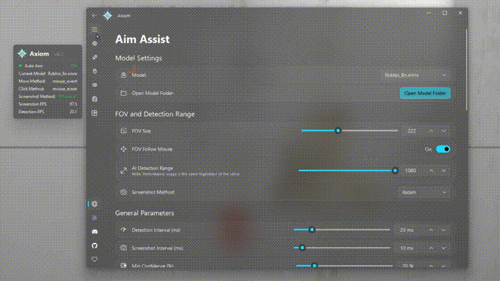

<div align="center">

[](https://github.com/iishong0w0/Axiom-AI-Aimbot/stargazers)


<h1>Axiom AI</h1>
<p>Adaptive aim assistance powered by computer vision to support gamers who need it most.</p>

## <a href="https://github.com/iishong0w0/Axiom-AI-Aimbot/releases/latest"><strong>Download Latest Release</strong></a>
## <a href="https://discord.gg/h4dEh3b8Bt">Discord</a>

<p>
  
</p>

<p><strong>If this project helps you, please give us a ⭐ Star!</strong></p>

</div>

## Overview

Axiom AI is a sophisticated computer vision application designed for real-time object detection and interaction. Built with Python and ONNX Runtime, it leverages DirectML for high-performance GPU acceleration to provide low-latency aim assistance. Featuring a modern Fluent Design UI with acrylic effects, multi-language support, and an intuitive setup wizard, Axiom makes advanced aim assistance accessible to everyone.

## Key Features

- **Advanced Aim Control**
  - PID controller with separate X/Y axis tuning for precise adjustments.
  - Bézier curve smoothing for natural, human-like mouse movement.
  - Customizable FOV and independent detection range.
  - Single-target mode for focusing on the nearest threat.
  - FOV follows mouse cursor for dynamic aiming.
  - Configurable head/body region ratios for fine-tuned targeting.

- **Smart Tracker (Prediction System)**
  - Velocity-based motion prediction for leading moving targets.
  - Adaptive smoothing with configurable prediction time.
  - Zero-lag reset on sudden direction changes or stops.
  - Visual prediction overlay for debugging and tuning.

- **Auto Fire (Triggerbot)**
  - Adjustable delay and fire intervals.
  - Target priority settings (Head / Body / Both).
  - Always-on mode or key-activated toggle.

- **High Performance**
  - ONNX Runtime with DirectML for GPU-accelerated inference.
  - DML ↔ CPU automatic fallback for maximum compatibility.
  - Low-latency capture and inference loop with configurable intervals.
  - Performance mode with optimized queue management.
  - Idle detection throttling to reduce resource usage when not aiming.
  - **Multiple Input Methods**
    - **mouse_event**
    - **ddxoft**
    - **Arduino Leonardo**
    - **Xbox 360 Virtual Controller**
    - **makcu**

- **Modern Fluent Design UI**
  - Built with PyQt6 + QFluentWidgets for a native Windows 11 look.
  - Acrylic (frosted glass) window effect with configurable transparency.
  - Dark / Light theme toggle.
  - First-run Setup Wizard for quick configuration.

- **Multi-Language Interface**
  - English, 中文, Français, Deutsch, हिन्दी, 日本語, 한국어, Português, Русский, Español.

## Supported Games (Pre-trained Models)

| Model | File |
|-------|------|
| Apex Legends | `apex.onnx` |
| Counter-Strike 2 | `CS2.onnx` |
| Fortnite | `Fornite.onnx` |
| PUBG | `Pubg.onnx` |
| Roblox | `Roblox.onnx` |
| Valorant | `Valorant[PURPLE].onnx` |

> You can also train and import your own ONNX models.

## Why does Axiom exist?

Axiom is designed for gamers who are at a disadvantage compared to regular players, including but not limited to:
- Players grieving from parental loss
- Physical disabilities
- Intellectual disabilities
- Visual impairments
- Poor hand-eye coordination
- Poor FPS performance
- Hand tremors
- Parkinson's disease
- Neurological disorders
- Players with one arm/hand
- Players using feet due to hand loss
- Players using mouth due to limb loss
- Paralyzed players using brain-computer interfaces or eye trackers
- Colorblind players
- Blind players
- Players without glasses
- Elderly players
- Chronic fatigue syndrome
- Nystagmus sufferers
- Brain injury sequelae
- Spatial perception disorders
- Anxiety disorders
- ADHD
- Movement disorders
- Autism
- Sleep-deprived players
- Overconfident players
- Players prone to overthinking
- Emotionally volatile players
- Wrong DPI settings
- No mousepad users
- Limited mouse space
- Low-quality mouse users
- Cloud gaming users
- Mouse acceleration enabled
- No air conditioning in hot/humid areas
- Sweaty hands causing mouse slippage
- Poor posture or low chairs
- Very young child players
- Beginners or untrained players
- Unstable vision players
- Special controller users
- Lucid dreamers
- Sixth sense aiming players
- Religious players who consider aiming sinful
- Fatalists who believe fate decides everything
- Players seeking randomness and chaos
- Role-playing blind snipers
- Players who think crosshairs are decorative
- Players who think they're in third person
- Crosshair drift syndrome sufferers
- Voice navigation aiming players
- Schizophrenia
- Parallel world delay sync players
- Quantum state players
- Left-right hand fighting players
- Players who think right-click is fire
- Internal slow-motion animation players
- Moral players who wait for enemies to shoot first
- Hardware flip party
- Players who only aim at enemy weapons
- Players who only aim at enemy feet
- Players who only aim at enemy hands
- Players who only aim at enemy genitals
- Pixel-level instruction followers
- Players always aiming at the floor
- Feng shui players
- Players who chant before shooting
- Astrology-based FPS players
- Bad pixels on crosshair
- Screen reflection showing face in center
- Auto-sliding chairs
- Eyes-closed FPS challengers
- Left-hand-only announcement players
- No crosshair but forgot transparent crosshair stickers
- Noodle-eating players
- Extreme hypoglycemia sufferers
- Drunk players
- Extreme binocular disparity
- Sleep paralysis FPS players
- Players who believe enemies are illusions
- Players who can't distinguish directions
- Players who treat screen center as blind spot
- Severe choice paralysis
- Anti-authority players
- Performance anxiety players
- Players who don't want to harm virtual life
- Vibrating bed FPS players
- Low battery wireless mouse users
- 24FPS monitor users
- Slow reaction but fast movement players
- High altitude residents
- Quantum superposition enemy believers
- Mind's eye believers
- Wrong muscle memory players
- Projector users
- Cat-occupied mousepad players

> **Important Notice**: This software is licensed under the PolyForm Noncommercial License 1.0.0. Commercial use is strictly prohibited.

## System Requirements

### Minimum Requirements
- **OS**: Windows 10/11 (64-bit)
- **RAM**: 16 GB
- **Graphics**: GTX 1060 6 GB / RX 580 8 GB (DirectX 12 compatible)

### Recommended Requirements
- **OS**: Windows 11 (64-bit)
- **RAM**: 32 GB or higher
- **Graphics**: RTX 3060 or better

## Usage

### Basic Operation

1. **Launch the Application**
   - Run `啟動Launcher.bat` or `python src/main.py`.
   - On first launch, the **Setup Wizard** will guide you through initial configuration (language, theme, model selection).

2. **Configure Settings**
   - **Aim Tab** — Select your game model, adjust FOV, detection range, and tune PID settings.
   - **Trigger Tab** — Configure auto-fire delay, interval, and target priority.
   - **Keys Tab** — Set your preferred hotkeys for toggling aim and auto-fire.
   - **Visuals Tab** — Customize overlays (FOV circle, bounding boxes, status panel).
   - **Configs Tab** — Save / load configuration presets.
   - **Other Tab** — Mouse method, Arduino, Xbox controller, performance, and advanced options.

3. **Start Detection**
   - Press the configured toggle key (default: `Insert`).
   - The system will begin real-time detection and overlay.

### Configuration Files

Settings are automatically saved to `config.json` in the project root. You can also save/load named presets via the **Configs** tab.

## Project Structure

```
Axiom/
├── 啟動Launcher.bat          # Quick-start launcher
├── config/                   # Saved configuration presets
├── Model/                    # ONNX model files
├── src/
│   ├── main.py               # Application entry point
│   ├── version.py            # Version info
│   ├── core/                 # Core logic
│   │   ├── ai_loop.py        # Main detection & aim loop
│   │   ├── auto_fire.py      # Triggerbot logic
│   │   ├── config.py         # Configuration class & save/load
│   │   ├── inference.py      # ONNX inference & PID controller
│   │   ├── smart_tracker.py  # Velocity-based prediction tracker
│   │   ├── key_listener.py   # Global hotkey listener
│   │   ├── updater.py        # Auto-update checker
│   │   └── language_data/    # Multi-language JSON files
│   ├── gui/
│   │   ├── overlay.py        # DirectX overlay (FOV, boxes)
│   │   ├── status_panel.py   # In-game status panel
│   │   └── fluent_app/       # Fluent Design main window & pages
│   └── win_utils/            # Windows utilities
│       ├── mouse_move.py     # Mouse movement backends
│       ├── mouse_click.py    # Mouse click simulation
│       ├── arduino_mouse.py  # Arduino Leonardo HID driver
│       ├── ddxoft_mouse.py   # ddxoft driver integration
│       └── xbox_controller.py# Virtual Xbox 360 gamepad
└── LICENSE.txt
```

## 📄 License

This project is licensed under the **PolyForm Noncommercial License 1.0.0**.

- ❌ **No Commercial Use** — This software cannot be used for any commercial purpose.
- ✅ **Personal Use** — Free for personal, educational, and research purposes.
- ✅ **Modification** — You may modify and distribute the software.
- ✅ **Attribution** — Must include original license and copyright notice.

For full license details, see [LICENSE.txt](LICENSE.txt) or visit [PolyForm Noncommercial License](https://polyformproject.org/licenses/noncommercial/1.0.0/).

## 📞 Contact

- **Discord**: [Join our community](https://discord.gg/h4dEh3b8Bt)
- **GitHub**: [iishong0w0](https://github.com/iishong0w0)
- **Email**: iis20160512@gmail.com

### Support Channels

- **Discord Server** — Community support and discussions.
- **GitHub Issues** — Bug reports and feature requests.
- **Email** — Direct communication with the developer.

---

**Disclaimer**: This software is provided "as is" without warranty. Use at your own risk. The developers are not responsible for any consequences of using this software. See [Disclaimer.md](Disclaimer.md) for full terms.

**Copyright © 2025-2026 iisHong0w0. All rights reserved.**
